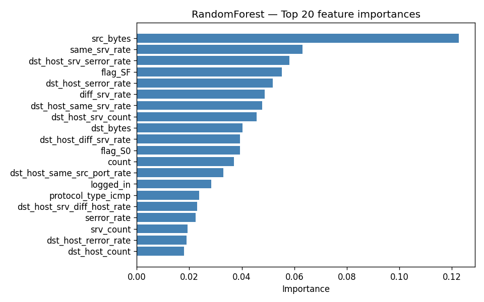
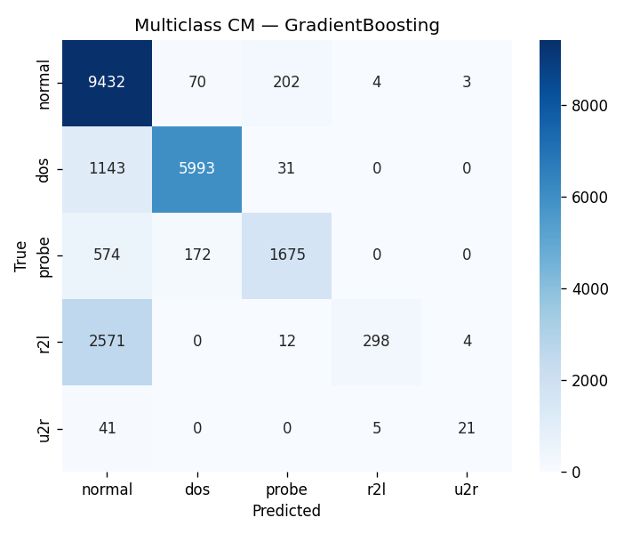

# Network Intrusion Detection on NSL-KDD

Russian version (primary): [README.md](README.md).

A portfolio ML project: classifying network connections as normal or attacks
using the NSL-KDD benchmark dataset.

## Dataset

NSL-KDD is an improved version of the KDD Cup 1999 intrusion detection dataset.

- Training set: KDDTrain+ (125 973 records)
- Test set: KDDTest+ (22 544 records)
- 3 categorical features: `protocol_type`, `service`, `flag`
- 38 numeric features
- 5 classes: normal, dos, probe, r2l, u2r

The test set is intentionally harder — it contains attack variants not seen during training.
Train CV accuracy is higher than test accuracy, and that gap is expected and honest.

## Approach

Preprocessing:
- One-hot encode categorical features (122 total features after encoding)
- StandardScaler on numeric columns
- Align train/test columns — rare service categories may be absent from test

Models: LogisticRegression (baseline), RandomForest, GradientBoosting.  
Two tasks: binary (normal vs attack) and multiclass (normal / dos / probe / r2l / u2r).

## Results

### Binary (normal vs attack)

| Model               | CV acc (train)    | Test acc | F1-macro | ROC-AUC |
|---------------------|-------------------|----------|----------|---------|
| LogisticRegression  | 0.9728 +/- 0.0001 | 0.7535   | 0.7531   | 0.7921  |
| RandomForest        | 0.9989 +/- 0.0002 | 0.7659   | 0.7647   | 0.9600  |
| GradientBoosting    | 0.9955 +/- 0.0003 | 0.8073   | 0.8071   | 0.9447  |

### Multiclass (5 classes)

| Model               | Test acc | F1-macro | F1 dos | F1 probe | F1 r2l | F1 u2r |
|---------------------|----------|----------|--------|----------|--------|--------|
| LogisticRegression  | 0.7603   | 0.5715   | 0.8907 | 0.8194   | 0.0277 | 0.3448 |
| RandomForest        | 0.7526   | 0.4863   | 0.8958 | 0.6927   | 0.0320 | 0.0286 |
| GradientBoosting    | 0.7727   | 0.6177   | 0.8943 | 0.7717   | 0.1867 | 0.4421 |

Best F1-macro on multiclass: GradientBoosting (0.6177).  
Best ROC-AUC on binary: RandomForest (0.9600).

### Plots

Feature importances (RandomForest) — which connection attributes drive the decision:



Confusion matrix, GradientBoosting, multiclass:



## Limitations

- R2L (~995 train samples) and U2R (~52 train samples) are severely underrepresented.
  U2R F1 for RandomForest is near zero — a direct consequence of too few training examples,
  not an implementation error.
- KDDTest+ includes attack variants not seen in training, so generalization is fundamentally limited.
- Improvements: SMOTE or class_weight for imbalance; XGBoost/LightGBM; two-stage classifier
  (binary normal/attack first, then attack-type classification).

## How to Reproduce

```bash
cd ids-nsl-kdd
python3 -m venv venv
source venv/bin/activate
pip install -r requirements.txt
python src/train.py       # downloads data automatically, trains, saves metrics
```

Jupyter notebook:

```bash
python -m ipykernel install --user --name ids-nsl-kdd --display-name "IDS NSL-KDD (venv)"
jupyter notebook notebook/ids.ipynb
```

## Project Layout

```
ids-nsl-kdd/
├── data/               # raw data (not committed)
├── figures/            # PNG plots (confusion matrices, F1 bars, feature importances)
├── notebook/
│   └── ids.ipynb       # narrative notebook: EDA + preprocessing + models + discussion
├── src/
│   ├── __init__.py
│   ├── data.py         # download, load, preprocess
│   └── train.py        # train, evaluate, save figures and metrics.json
├── metrics.json        # all numeric results
├── requirements.txt
├── .gitignore
├── README.md           # Russian README
└── README.en.md        # this file
```
